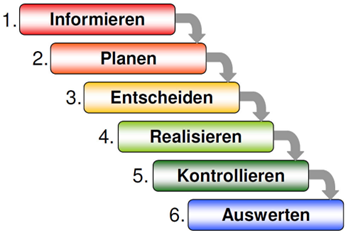

# Teil 1 Einleitung
In diesem Kapitel wird ins Thema der Arbeit eingeführt. Es beschreibt den Hintergrund und die Relevanz des Themas. Sie definiert das Ziel der der Arbeit und formuliert die zentralen Fragen. Zudem gibt die Einleitung einen kurzen Überblick über den Aufbau der Arbeit, um eine klare Orientierung zu bieten.

- [Teil 1 Einleitung](#teil-1-einleitung)
- [Versionenverzeichniss](#versionenverzeichniss)
- [Aufgabenstellung](#aufgabenstellung)
  - [Ausgangslage](#ausgangslage)
  - [Ziele](#ziele)
  - [Mittel und Methoden](#mittel-und-methoden)
    - [Sachmittel](#sachmittel)
    - [Programmiersprache](#programmiersprache)
  - [Werkzeuge](#werkzeuge)
  - [Methode IPERKA](#methode-iperka)
- [Projektorganisation](#projektorganisation)
  - [Beteiligte Personen](#beteiligte-personen)
    - [Kanditatin](#kanditatin)
    - [Dozenten](#dozenten)
- [Datensicherung](#datensicherung)
- [Besprechungsprotokoll](#besprechungsprotokoll)
  - [Zwischengespräch 1](#zwischengespräch-1)
    - [Besprechungsnotiz](#besprechungsnotiz)
  - [Zwischengespräch 2](#zwischengespräch-2)
    - [Besprechungsnotiz](#besprechungsnotiz-1)
  - [Zwischengespräch 3](#zwischengespräch-3)
    - [Besprechungsnotiz](#besprechungsnotiz-2)


# Versionenverzeichniss

| Version | Datum | Autor | Bemerkung | 
| ------- | ------ | ---- | --------- |
| 1.0 | 24.10.2024 | Laura Dubach | Zeitplan und Notion erstellen |
| 1.1 | 30.10.2024 | Laura Dubach | Dokument erstellt und den Aufbau gestartet. |
| 1.2 |  | Laura Dubach | |

# Aufgabenstellung
Ziel dieser Arbeit ist es, einen automatisierten Onboarding-Prozess für neue Mitarbeiter
zu entwickeln, der mit Python und Camunda die aktuellen manuellen Abläufe ablöst. Dabei sollen Python-Skripte wiederkehrende Aufgaben wie die Datenerfassung, Benutzerkontenerstellung und Rechtevergabe übernehmen, während Camunda BPM den gesamten Prozess modelliert und steuert. Die Automatisierung soll die Effizienz des Prozesses steigern, Fehlerquellen minimieren und die Transparenz erhöhen, insbesondere im Hinblick auf eine skalierbare Lösung für Unternehmen mit wachsender Mitarbeiterzahl.

## Ausgangslage
In vielen Unternehmen erfolgt der Onboarding-Prozess für neue Mitarbeiter
noch weitgehend manuell. Typische Aufgaben wie die Erfassung von Mitarbeiterdaten, das Einrichten von Benutzerkonten und die Vergabe von Zugriffsrechten sind zeitaufwändig und fehleranfällig. Dies ist Zeitaufwändig und durch das manuelle erstellen, können auch Fehler passieren. Das Unternehmen wünscht sich daher eine automatisierte Lösung, die den Onboarding-Prozess effizienter und transparenter gestaltet und die Fehlerfreiheit erfüllt.

## Ziele
Das Ziel dieser Semesterarbeit ist es, den Onboarding-Prozess eines Unternehmens zu analysieren und eine effiziente, automatisierte Lösung zur Durchführung dieses Prozesses zu entwickeln. Hierbei soll Python als zentrale Programmiersprache zur Implementierung der Geschäftslogik genutzt werden, während die Prozessautomatisierung mit Camunda realisiert wird.
Im Detail soll ein funktionierender Prototyp erstellt werden, der den gesamten Onboarding-Prozess, von der Erstellung eines neuen Mitarbeiters bis hin zur Bereitstellung von Zugangsdaten und Ressourcen, automatisiert abwickelt. Die Automatisierung soll durch eine Kombination von Skripten in Python und modellierten BPMN-Prozessen (Business Process Model and Notation) in Camunda erfolgen.

Folgende Aspekte stehen im Fokus:
1. Analyse des aktuellen Onboarding-Prozesses: Erhebung der Anforderungen und Identifizierung der Schritte, die automatisiert werden können.
2. Entwicklung einer Python-Lösung: Implementierung von einem Skript zur Abwicklung der Geschäftslogik.
3. Camunda-Integration: Modellierung des Prozesses in BPMN und Integration dem Python-Skript in den Workflow.
4. Evaluation der Lösung: Überprüfung der Effizienzsteigerung und Fehlerreduktion im Vergleich zu manuell durchgeführten Onboarding-Prozessen.
Das Ergebnis dieser Arbeit soll eine wiederverwendbare und skalierbare Lösung sein, die das Onboarding vereinfacht, beschleunigt und gleichzeitig die menschlichen Fehler minimiert.

## Mittel und Methoden
### Sachmittel
- Unterrichtsressourcen
- Microsoft Dokumentationen
- Interne Hilfe der Firma

### Programmiersprache
- Python

## Werkzeuge
- ChatGPT
- PyCharm
- Camunda modeler
- Docker desktop
- Camunda
- Azure
- Microsoft Admin center
- Visual Studio Code
- PowerPoint

## Methode IPERKA
Dies ist eine Sechs-Schritte-Methode, welche man für die Umsetzung eines Projektes verwendet. Sie hilft dabei, ein Projekt von Grund auf gut zu planen und zu verstehen. Man soll jeden Schritt genau durchführen, um jegliche Probleme umgehen zu können. Zum Schluss der Methode wird auch verlangt, dass man das Projekt reflektiert, um aus allfälligen Fehlern auch lernen zu können.  
> (Bexio 2020) [Quelle](https://www.bexio.com/de-CH/blog/view/iperka-methode)



# Projektorganisation
## Beteiligte Personen

### Kanditatin

```
Laura Joana Dubach
Funktion: Projektleiterin
P: 079 355 78 24
Github: lauradubach
E-Mail: laura.dubach@itnetx.ch
```
### Dozenten

```
Philipp Rohr
Funktion: Fachdozent
Github: phrohr
E-Mail: philipp.rohr@tbz.ch
```
```
Dörzbach Armin
Funktion: Fachdozent
Github: armindoerzbachtbz
E-Mail: armin.doerzbach@tbz.ch
```

# Datensicherung
Damit keine Daten verloren gehen können, werde ich alle Dokumente auf meinem OneDrive abspeichern. Zusätzlich werde ich die Daten auf einen USB-Stick abspeichern, damit ich im Worstcase Szenario immer noch ein Backup besitze. 

# Besprechungsprotokoll
## Zwischengespräch 1

| Besprechung | Datum | Uhrzeit | Teilnehmer | 
| ---- | ---- | ---- | ---- |

### Besprechungsnotiz

## Zwischengespräch 2

| Besprechung | Datum | Uhrzeit | Teilnehmer | 
| ---- | ---- | ---- | ---- |

### Besprechungsnotiz

## Zwischengespräch 3

| Besprechung | Datum | Uhrzeit | Teilnehmer | 
| ---- | ---- | ---- | ---- |

### Besprechungsnotiz

> Back [Page](https://github.com/lauradubach/Semesterarbeit2?tab=readme-ov-file)
>
> Next [Page](https://github.com/lauradubach/Semesterarbeit2/blob/main/Sites/Teil%202%20Vorbereitung.md)

