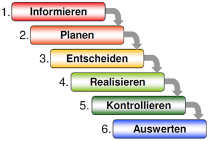

# Teil 1 Initialisierung

In diesem Kapitel wird ins Thema der Arbeit eingeführt. Es beschreibt den Hintergrund und die Relevanz des Themas. Sie definiert das Ziel der Arbeit und formuliert die zentralen Fragen. Zudem gibt die Intialisierung einen kurzen Überblick über den Aufbau der Arbeit um eine klare Orientierung zu bieten.

- [Teil 1 Initialisierung](#teil-1-initialisierung)
- [Versionenverzeichniss](#versionenverzeichniss)
- [Aufgabenstellung](#aufgabenstellung)
  - [Ausgangslage](#ausgangslage)
  - [Ziele](#ziele)
  - [Mittel und Methoden](#mittel-und-methoden)
    - [Sachmittel](#sachmittel)
    - [Programmiersprache](#programmiersprache)
  - [Werkzeuge](#werkzeuge)
  - [Methode IPERKA](#methode-iperka)
- [Projektorganisation](#projektorganisation)
  - [Beteiligte Personen](#beteiligte-personen)
    - [Kanditatin](#kanditatin)
    - [Dozenten](#dozenten)
- [Datensicherung](#datensicherung)
- [Besprechungsprotokoll](#besprechungsprotokoll)
  - [Zwischengespräch 1](#zwischengespräch-1)
    - [Besprechungsnotiz](#besprechungsnotiz)
  - [Zwischengespräch 2](#zwischengespräch-2)
    - [Besprechungsnotiz](#besprechungsnotiz-1)


# Versionenverzeichniss

| Version | Datum  | Autor | Bemerkung | 
| ------- | ------ | ----  | --------- |
| 1.0 | 24.10.2024 | Laura Dubach | Zeitplan und Notion erstellen |
| 1.1 | 30.10.2024 | Laura Dubach | Dokument erstellt und den Aufbau gestartet |
| 1.2 | 01.11.2024 | Laura Dubach | Start dokumentation Kapitel Initialisierung  |
| 1.3 | 06.11.2024 | Laura Dubach | Seusag sowie Ist- und Soll Zustand dokumentieren |
| 1.4 | 13.11.2024 | Laura Dubach | Tool vergleich & Entscheidungsmatrix |
| 1.5 | 14.11.2024 | Laura Dubach | Implemetierungsplan |
| 1.6 | 27.11.2024 | Laura Dubach | Besprechungsnotiz schreiben |
| 1.7 | 03.12.2024 | Laura Dubach | Start Python Skript |
| 1.8 | 11.12.2024 | Laura Dubach | Seusag überarbeiten |
| 1.9 | 18.12.2024 | Laura Dubach | Umsetzung Skript und Troubleshooting beschreiben |
| 2.0 | 23.12.2024 | Laura Dubach | Fallbacksolution & Tests dokumentieren |
| 2.1 | 30.12.2024 | Laura Dubach | Dokumentation verbessern (Aufbau, Struktur, Rechtschreibung) |
| 2.2 | 13.01.2025 | Laura Dubach | Besprechungsnotiz 2 dokumentieren |
| 2.3 | 15.01.2025 | Laura Dubach | Abschluss dokumentieren, Reflexion schreiben |
| 2.4 | 23.01.2025 | Laura Dubach | Finalisierung Dokumentation |

# Aufgabenstellung

Ziel dieser Arbeit ist es, einen automatisierten Onboarding-Prozess für neue Mitarbeiter zu entwickeln, der mit Python und Camunda die aktuellen manuellen Abläufe ablöst. Dabei sollen Python-Skripte wiederkehrende Aufgaben wie die Datenerfassung, Benutzerkontenerstellung und Rechtevergabe übernehmen, während Camunda BPM den gesamten Prozess modelliert und steuert. Die Automatisierung soll die Effizienz des Prozesses steigern, Fehlerquellen minimieren und die Transparenz erhöhen, insbesondere im Hinblick auf eine skalierbare Lösung für Unternehmen mit wachsender Mitarbeiterzahl.

## Ausgangslage

In vielen Unternehmen erfolgt der Onboarding-Prozess für neue Mitarbeiter noch weitgehend manuell. Typische Aufgaben wie die Erfassung von Mitarbeiterdaten, das Einrichten von Benutzerkonten und die Vergabe von Zugriffsrechten sind zeitaufwändig und fehleranfällig. Durch das manuelle erstellen, können auch Fehler passieren. Das Unternehmen wünscht sich daher eine automatisierte Lösung, die den Onboarding-Prozess effizienter und transparenter gestaltet und die Fehlerfreiheit erfüllt.

## Ziele

Das Ziel dieser Semesterarbeit ist es, den Onboarding-Prozess eines Unternehmens zu analysieren und eine effiziente, automatisierte Lösung zur Durchführung dieses Prozesses zu entwickeln. Hierbei soll Python als zentrale Programmiersprache zur Implementierung der Geschäftslogik genutzt werden, während die Prozessautomatisierung mit Camunda realisiert wird.
Im Detail soll ein funktionierender Prototyp erstellt werden, der den gesamten Onboarding-Prozess, von der Erstellung eines neuen Mitarbeiters bis hin zur Bereitstellung von Zugangsdaten und Ressourcen, automatisiert abwickelt. Die Automatisierung soll durch eine Kombination von Skripten in Python und modellierten BPMN-Prozessen (Business Process Model and Notation) in Camunda erfolgen.

Folgende Aspekte stehen im Fokus:

1. Analyse des aktuellen Onboarding-Prozesses: Erhebung der Anforderungen und Identifizierung der Schritte, die automatisiert werden können.
2. Entwicklung einer Python-Lösung: Implementierung von einem Skript zur Abwicklung der Geschäftslogik.
3. Camunda-Integration: Modellierung des Prozesses in BPMN und Integration des Python-Skript in den Workflow.
4. Evaluation der Lösung: Überprüfung der Effizienzsteigerung und Fehlerreduktion im Vergleich zu manuell durchgeführten Onboarding-Prozessen.

Das Ergebnis dieser Arbeit soll eine wiederverwendbare und skalierbare Lösung sein, die das Onboarding vereinfacht, beschleunigt und gleichzeitig die menschlichen Fehler minimiert.

## Mittel und Methoden

### Sachmittel

- Unterrichtsressourcen
- Microsoft Dokumentationen
- Interne Hilfe der Firma
- Unterstützung der Dozenten

### Programmiersprache

- Python

## Werkzeuge

- ChatGPT
- PyCharm
- Camunda modeler
- Docker desktop
- Camunda
- Azure
- Microsoft Admin center
- Visual Studio Code
- PowerPoint

## Methode IPERKA

Dies ist eine Sechs-Schritte-Methode, welche man für die Umsetzung eines Projektes verwendet. Sie hilft dabei, ein Projekt von Grund auf gut zu planen und zu verstehen. Man soll jeden Schritt genau durchführen, um jegliche Probleme umgehen zu können. Zum Schluss der Methode wird auch verlangt, dass man das Projekt reflektiert, um aus allfälligen Fehlern lernen zu können. IPERKA habe ich gewählt, da ich schon gute Erfahrungen in verschiedenen Projekten damit gemacht habe. Ich fühle mich sicher damit zu arbeiten, damit war es für mich die beste Projektmethode für diese Semesterarbeit.

> (Bexio 2020) [Quelle](https://www.bexio.com/de-CH/blog/view/iperka-methode)



# Projektorganisation

## Beteiligte Personen

### Kanditatin

```
Laura Joana Dubach
Funktion: Projektleiterin
P: 079 355 78 24
Github: lauradubach
Business E-Mail: laura.dubach@itnetx.ch
School E-Mail: laura.dubach@edu.tbz.ch
```
### Dozenten

```
Rohr Philipp
Funktion: PRJ-Dozent
Github: phrohr
E-Mail: philipp.rohr@tbz.ch
```
```
Dörzbach Armin
Funktion: Fachdozent
Github: armindoerzbachtbz
E-Mail: armin.doerzbach@tbz.ch
```

# Datensicherung

Damit keine Daten verloren gehen, werde ich alle Dokumente auf meinem OneDrive abspeichern. Zusätzlich werde ich die Daten auf einen USB-Stick abspeichern, damit ich im Worstcase Szenario ein Backup besitze. 

# Besprechungsprotokoll

## Zwischengespräch 1

| Besprechung | Datum | Uhrzeit | Teilnehmer | 
| ---- | ---- | ---- | ---- |
| 1 | 22.11.2024 | 18:15 | Philipp Rohr, Corrado Parisi, Laura Dubach |

### Besprechungsnotiz

Wir haben uns über einen Teamscall getroffen. Ich hatte 2 Fragen zu meinem Projekt. Die erste war, ob ich den Aufbau von meiner 1ten Arbeit übernehmen darf. Philipp meinte, dass genau dies das Ziel sei und wenn er vorher nichts bemängelt habe, ich das so machen darf. Das Ziel ist ja auch, dass wir eine perfekte Vorlage für unsere Arbeiten haben und somit Aufwand einsparen.

Danach wollte ich, dass er sich mein Seusag anschaut, da ich mir unsicher war, ob dies so gewünscht wird. Er hat mir folgende Änderungsvorschläge gegeben:

- Der Punkt "Hilfsmittel" ist zu allgemein und ich sollte ein anderes Wort verwenden.
- Was nicht im Projekt integriert ist, soll ausserhalb der Bubble gesetzt werden, sonst sei es zu verwirrend.
- Die einzelnen Punkte weisen momentan noch keine Verbindung auf, dies sollte angepasst werden.

Das Gespräch war gut und sehr informiativ. Alle meine Fragen konnten beantwortet werden, so kann ich nun weiter an meiner Arbeit schreiben.

## Zwischengespräch 2

| Besprechung | Datum | Uhrzeit | Teilnehmer | 
| ---- | ---- | ---- | ---- |
| 2 | 13.01.2025 | 18:00 | Philipp Rohr, Laura Dubach |

### Besprechungsnotiz

Auch dieses Gespräch wurde über einen Teamscall durchgeführt. Folgende Fragen habe ich gestellt:

1. Die Error Meldungen habe ich bereits beschrieben, inkulsive Lösungen, soll das Skript auch bechrieben werden (wie es erstellt wurde usw)?
1. Fallbacksolution macht in meinem Projekt wenig Sinn, da es auf einem Demo Tenant umgesetzt wurde. Soll ich einfach in ein Paar Worten beschreiben, wie man vorgehen sollte, falls das Skript nicht mehr läuft?

Bei der ersten Frage meinte er, dass ich nicht beschreiben soll, wie ich das Skript geschrieben habe und was, was umsetzt. Das würde viel zu lange dauern. Bei der zweiten Frage meinte er auch, dass die Fallbacksolution in diesem Projekt wenig Sinn ergibt, es würde reichen, wenn ich erkläre wie man vorgeht, wenn das Skript nicht funktioniert.

Danach hatte Philipp noch eine Idee, wie ich meine Dokumentation verbessern kann. Meine Titel sind zu wenig genau.
Er meinte die "Einleitung" könnte man zum Beispiel "Initiialisierung" nennen. Der Titel Vorbereitung ist zu wenig aussagend. Hier würde besser passen "Konseption". Realisierung passt, er meinte aber, ich soll vor dem Abschnitt "Abschluss" einen weiteren Abschnitt machen, wo beschrieben wird, wie das Projekt ins Busines eingeführt wird. Zum Beispiel wie die alten prozesse abgelöst werden und wie das Team geschult wird. Dies aber nur Theoretisch.


> Back [Page](https://github.com/lauradubach/Semesterarbeit2?tab=readme-ov-file)
>
> Next [Page](https://github.com/lauradubach/Semesterarbeit2/blob/main/Sites/Teil%202%20Konzeption.md)

