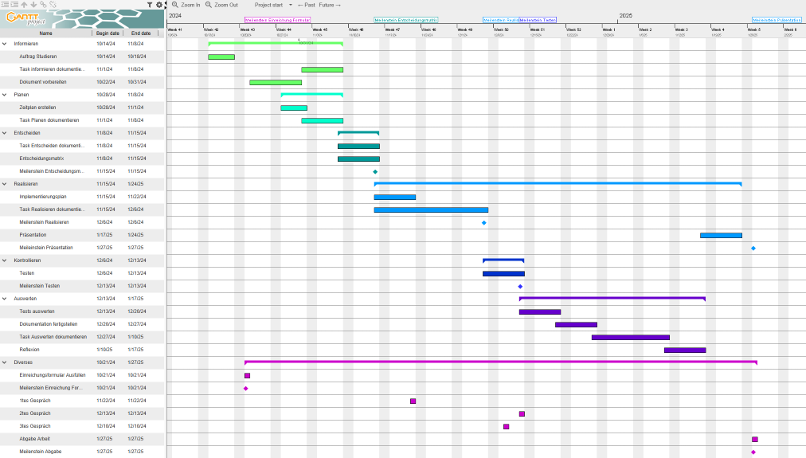

# Teil 2 Vorbereitung
Nun gehen wir ins Thema Vorbereitung über. Wie es der Name schon ankündigt, wird hier das ganze Projekt Vorbereitet. Die Ausgangslage und Anforderungen werden beschrieben, auch was das Ziel des Projektes wird aufgezeigt. Die Planung wird gemacht und es werden Entscheidungen getroffen um das Projekt mit den Optimalen Tools umzusetzten.

- [Teil 2 Vorbereitung](#teil-2-vorbereitung)
- [Informieren](#informieren)
  - [Analyse des aktuellen Onboarding Prozess](#analyse-des-aktuellen-onboarding-prozess)
    - [Manuelle Erstellung des Benutzerkontos](#manuelle-erstellung-des-benutzerkontos)
    - [Manuelle Zuweisung von Lizenzen und Gruppen:](#manuelle-zuweisung-von-lizenzen-und-gruppen)
    - [Potenzielle Herausforderungen und Risiken:](#potenzielle-herausforderungen-und-risiken)
  - [Anforderungen erheben](#anforderungen-erheben)
    - [Integration von Azure und Camunda](#integration-von-azure-und-camunda)
    - [Definieren der Onboarding-Prozessschritte in Camunda](#definieren-der-onboarding-prozessschritte-in-camunda)
    - [Automatisierung mit Python-Skripten](#automatisierung-mit-python-skripten)
    - [Sicherheits- und Compliance-Anforderungen](#sicherheits--und-compliance-anforderungen)
    - [Beispielhafte Architektur:](#beispielhafte-architektur)
    - [Zusammenfassung der Anforderungen](#zusammenfassung-der-anforderungen)
  - [Was kann automatisieren werden?](#was-kann-automatisieren-werden)
    - [Automatische Benutzererstellung in Azure](#automatische-benutzererstellung-in-azure)
    - [Automatische Lizenzzuweisung](#automatische-lizenzzuweisung)
    - [Automatisierte Gruppenzuweisung](#automatisierte-gruppenzuweisung)
    - [Zusammenfassung der Automatisierungsmöglichkeiten](#zusammenfassung-der-automatisierungsmöglichkeiten)
  - [IST- und SOLL Zustand](#ist--und-soll-zustand)
    - [IST Zustand](#ist-zustand)
    - [SOLL Zustand](#soll-zustand)
  - [Seusag](#seusag)
    - [Systemgrenzen](#systemgrenzen)
      - [Technologische Systemgrenzen](#technologische-systemgrenzen)
      - [Funktionale Systemgrenzen](#funktionale-systemgrenzen)
      - [Organisatorische Systemgrenzen](#organisatorische-systemgrenzen)
- [Planen](#planen)
  - [Zeitplan](#zeitplan)
    - [Meilensteine](#meilensteine)
      - [Einreichungsformular](#einreichungsformular)
      - [Entscheidungsmatrix](#entscheidungsmatrix)
      - [Realisieren](#realisieren)
      - [Testen](#testen)
      - [Präsentation](#präsentation)
      - [Abgabe](#abgabe)
- [Entscheiden](#entscheiden)
  - [Produkte vergleichen](#produkte-vergleichen)
    - [Microsoft Power Automate](#microsoft-power-automate)
      - [Vorteile](#vorteile)
      - [Nachteile](#nachteile)
      - [Zusammenfassung](#zusammenfassung)
    - [Camunda](#camunda)
      - [Vorteile](#vorteile-1)
      - [Nachteile](#nachteile-1)
      - [Zusammenfassung](#zusammenfassung-1)
  - [Entscheidungsmatrix](#entscheidungsmatrix-1)
    - [Erklärung der Bewertung](#erklärung-der-bewertung)
    - [Fazit](#fazit)
  - [Wieso Azure Cloud?](#wieso-azure-cloud)
  - [Wieso Python?](#wieso-python)

# Informieren
In diesem Kapitel werde ich alle Informationen zusammentragen, um das Projekt umsetzten zu können.

## Analyse des aktuellen Onboarding Prozess
Das aktuelle Onboarding-Verfahren für neue Benutzer in der Azure-Umgebung ist stark manuell geprägt, was Zeit und Ressourcen beansprucht und potenzielle Fehlerquellen mit sich bringt. Der Ablauf gestaltet sich wie folgt:

### Manuelle Erstellung des Benutzerkontos
Jeder neue Benutzer wird in Azure Active Directory (AAD) von einem Administrator manuell erstellt. Dabei müssen grundlegende Informationen wie Benutzername, E-Mail und andere personenbezogene Daten von Hand eingegeben werden. Dies erfordert eine akkurate und vollständige Eingabe, um spätere Korrekturen oder Unstimmigkeiten zu vermeiden.

### Manuelle Zuweisung von Lizenzen und Gruppen:
Nachdem der Benutzer angelegt wurde, erfolgt die manuelle Zuweisung der erforderlichen Lizenzen, je nach Rolle oder Abteilung des neuen Mitarbeiters. Auch die Mitgliedschaft in verschiedenen Gruppen wird individuell vergeben, um den Zugriff auf die notwendigen Ressourcen und Anwendungen zu ermöglichen. Da dies manuell erfolgt, besteht das Risiko, dass Benutzer fälschlicherweise unzureichende oder zu umfangreiche Zugriffsrechte erhalten.

### Potenzielle Herausforderungen und Risiken:
Das stark manuelle Verfahren erhöht das Risiko für menschliche Fehler, wie Tippfehler, vergessene Zugriffsrechte oder falsche Gruppenzuweisungen. Dadurch können Sicherheits- und Compliance-Risiken entstehen, insbesondere wenn sensible Daten oder Ressourcen betroffen sind. Zudem erhöht sich durch diesen manuellen Ansatz die Einarbeitungszeit neuer Benutzer und das Onboarding verzögert sich.

Dieses manuelle Vorgehen im Onboarding ist zeitaufwändig und fehleranfällig und erschwert eine schnelle Anpassung an Unternehmensanforderungen. 

> (Chat GPT) [Quelle](https://chatgpt.com/share/6724ab57-b13c-800e-bfc9-da621fae374f)

## Anforderungen erheben
Um das Onboarding in Azure effizienter und automatisiert mit Python und Camunda umzusetzen, müssen verschiedene Anforderungen erfüllt werden. 

### Integration von Azure und Camunda
   - API-Zugriff auf Azure Active Directory: Die Azure AD REST API muss in Python verwendet werden, um Benutzerkonten zu erstellen, Lizenzen zuzuweisen und Gruppenmitgliedschaften zu verwalten.
   - Camunda-Integration: Camunda dient als BPMN-Engine (Business Process Model and Notation), die Workflows steuert und automatisierte Prozesse verwaltet. Python und Camunda können über REST-APIs kommunizieren, um den Workflow zu steuern und Zustandsänderungen zu überwachen.

### Definieren der Onboarding-Prozessschritte in Camunda
   - Prozessmodellierung: Der gesamte Onboarding-Prozess wird in Camunda modelliert.

### Automatisierung mit Python-Skripten
   - Benutzeranlage: Ein Python-Skript kann mithilfe der Azure AD API automatisch einen neuen Benutzer erstellen.
   - Lizenzzuweisung: Python kann die Lizenzzuweisungen über die Azure API automatisieren, basierend auf im Prozess festgelegten Variablen.
   - Gruppenmanagement: Gruppenmitgliedschaften lassen sich ebenfalls automatisiert zuweisen. Das Python-Skript ruft die Gruppeninformationen ab und weist Benutzer basierend auf Jobrolle oder Abteilung der entsprechenden Gruppe zu.

### Sicherheits- und Compliance-Anforderungen
   - Authentifizierung und Berechtigungen: Python-Skripte benötigen ein sicheres Authentifizierungsverfahren, um auf Azure-Ressourcen zuzugreifen.

### Beispielhafte Architektur:
- Camunda steuert den gesamten Workflow und sendet für jeden Prozessschritt REST-Anfragen an die Python-Skripte.
- Python-Skripte führen die API-Aufrufe an Azure AD aus und geben die Ergebnisse an Camunda zurück.

### Zusammenfassung der Anforderungen
- API-Kenntnisse: Azure AD API für Python und Camunda REST API.
- Python-Kompetenzen: Fähigkeit zur Entwicklung von Skripten für Benutzerverwaltung, Lizenz- und Gruppenmanagement.
- Prozessmodellierung: BPMN in Camunda für den Aufbau und die Steuerung des Onboardings.
- Fehlerbehandlung und Sicherheitsmaßnahmen in Python und Camunda, um Compliance sicherzustellen.

Mit dieser Architektur lassen sich manuelle Aufgaben reduzieren, Fehler vermeiden und ein konsistenter und dokumentierter Onboarding-Prozess etablieren.

> (Chat GPT) [Quelle](https://chatgpt.com/share/6724ab57-b13c-800e-bfc9-da621fae374f)

## Was kann automatisieren werden?
Um das Onboarding in Azure mit Python und Camunda effizienter zu gestalten, können mehrere Schritte automatisiert werden. Dabei gibt es verschiedene Bereiche, in denen die Automatisierung zu einer erheblichen Zeitersparnis, Fehlervermeidung und Prozessverbesserung führt.

### Automatische Benutzererstellung in Azure
   - Beschreibung: Das manuelle Anlegen eines Benutzers in Azure AD kann durch ein Python-Skript automatisiert werden, das die Azure AD API verwendet. Dies beinhaltet die Erfassung und Validierung der Benutzerdaten, die dann automatisch an Azure übergeben werden.
   - Vorteil: Vermeidet manuelle Eingabefehler und sorgt für einheitliche Benutzerdaten.

### Automatische Lizenzzuweisung
   - Beschreibung: Abhängig von der Rolle oder Abteilung des neuen Benutzers kann ein Python-Skript Lizenzen automatisiert zuweisen. Dazu könnten Bedingungen in Camunda hinterlegt werden, die auf den Benutzerdaten basieren und die entsprechenden Lizenzen automatisch zuteilen.
   - Vorteil: Zeitersparnis und Reduzierung des administrativen Aufwands, da keine manuelle Lizenzzuweisung erforderlich ist.

### Automatisierte Gruppenzuweisung
   - Beschreibung: Basierend auf den Jobrollen und Abteilungsinformationen können Benutzer automatisch den entsprechenden Azure AD-Gruppen zugewiesen werden, um Zugriff auf die benötigten Ressourcen zu erhalten. Camunda könnte den Gruppenzuweisungsprozess steuern, während Python-Skripte die tatsächlichen API-Aufrufe ausführen.
   - Vorteil: Sicherstellung eines einheitlichen und schnellen Zugriffs auf die richtigen Ressourcen.

### Zusammenfassung der Automatisierungsmöglichkeiten
Durch die Automatisierung dieser Schritte wird der gesamte Onboarding-Prozess beschleunigt und zuverlässiger gestaltet. Hier die wichtigsten Automatisierungsbereiche im Überblick:

1. Benutzererstellung in Azure AD
2. Lizenzzuweisung
3. Gruppenzuweisung

Durch diese Automatisierungen wird der manuelle Aufwand deutlich reduziert, und es entsteht ein strukturierter, effizienter Prozess, der weniger fehleranfällig ist und die Compliance-Anforderungen erfüllt.

> (Chat GPT) [Quelle](https://chatgpt.com/share/6724ab57-b13c-800e-bfc9-da621fae374f)

## IST- und SOLL Zustand

### IST Zustand
Der aktuelle Onboarding-Prozess ist manuell und weist folgende Probleme auf:
- Zeitaufwendig: Manuelle Abläufe wie Profilanlegung und Zugangserstellung führen zu Verzögerungen.
- Fehleranfälligkeit: Häufige manuelle Eingabefehler können Sicherheitsrisiken erhöhen.
- Mangelnde Skalierbarkeit: Der Aufwand steigt linear mit der Anzahl der Neueinstellungen.

### SOLL Zustand
Die automatisierte Lösung soll den Onboarding-Prozess effizienter gestalten:
- Automatisierung: Durch Python-Skripte und Camunda-Workflows wird der Prozess erheblich beschleunigt.
- Standardisierung: Ein BPMN-Workflow gewährleistet einheitliche Abläufe.
- Fehlerreduktion: Automatisierte Eingaben und Prüfungen senken das Fehlerrisiko.
- Zentrale Steuerung: Camunda ermöglicht die Prozessüberwachung und schnellere Fehlerbehebung.
- Skalierbarkeit: Die Lösung ist flexibel und für steigende Mitarbeiterzahlen geeignet.

## Seusag

### Systemgrenzen

#### Technologische Systemgrenzen
- Python: Die Geschäftslogik wird ausschließlich in Python umgesetzt; andere Sprachen oder Frameworks sind ausgeschlossen.
- Camunda: Nur Camunda wird für die Prozessautomatisierung und BPMN-Modellierung genutzt, alternative Tools sind nicht vorgesehen.
- Administrationstools: Es werden verschiedene Tools für die Umsetzung verwendet, wie zum Beispiel Visual Studio code oder Pycharm. Diese sind in den Mittel und Methoden fetsgelegt.
- Azure Cloud: Der Prozess wird in der Azure Cloud umgesetzt, da wir dies in der Firma verwenden. 

#### Funktionale Systemgrenzen
- User Offboardings/User changes: Der Prototyp deckt nur den Onboarding-Prozess neuer Mitarbeiter ab andere HR-Prozesse sind ausgeschlossen.
- Firmendaten: Es werden keine Firmendaten verwendet, um den Datenschutz zu gewährleisten.
- Berechtigungskonzept: In diesem Projekt wird kein Konzept erstellt, es wird sich an die vorhandenen vorgaben der Firma gehalten.

#### Organisatorische Systemgrenzen
- Projektmanagement: Als Methode wird IPERKA verwendet. Es werden keine anderen Methoden in diesem Projekt umgesetzt.
- Meetings: Es weden Zwischengespräche mit dem Fachdozenten gehalten und diese werden dokumentiert. Meetings werden mit dem Fachdozenten geplant und angepasst
- Abschluss: Das Enddatum dieses Projektes ist verbindlich. Nach dem Abschluss des Projektes wird keine Nachbearbeitung geplant

# Planen
Hier werde ich das ganze Projekt planen. Es wird ein Zeitplan erstellt, wann welche Tätigkeiten fällig sind und die Meilensteine genau beschrieben.

## Zeitplan

### Meilensteine
#### Einreichungsformular
Das Einreichungsformular ist der erste formelle Schritt zur Dokumentation des Projekts. Hier werden alle wichtigen Informationen zum Projekt gesammelt, zum Beispiel Zielsetzung, Projektbeschreib, Risiken, Mittel und Methoden. Dieses Formular dient als Grundlage zur Projektgenehmigung und bietet den Projektbeteiligten eine klare Übersicht über die Ziele und Anforderungen.

#### Entscheidungsmatrix
Die Entscheidungsmatrix hilft bei der Auswahl der besten Vorgehensweise oder Lösung für das Projekt. Verschiedene Kriterien werden mit Gewichtungen versehen und die möglichen Alternativen danach bewertet. Diese Matrix bietet eine objektive Entscheidungsgrundlage und unterstützt dabei, eine durchdachte Wahl zu treffen.

#### Realisieren
In der Realisierungsphase wird das Projekt in die Praxis umgesetzt. Hier beginnen die eigentlichen Arbeiten. In dieser Phase wird das Projekt schrittweise aufgebaut, und die vorherige Planung wird in konkrete Resultate umgesetzt.

#### Testen
In der Testphase wird das Projekt auf Funktionalität, Qualität und Zuverlässigkeit überprüft. Ziel ist es, sicherzustellen, dass das Ergebnis den Anforderungen entspricht und einwandfrei funktioniert. Eventuelle Fehler oder Mängel werden identifiziert und behoben. Diese Phase ist entscheidend, um sicherzustellen, dass das Endprodukt den Erwartungen und Standards gerecht wird.

#### Präsentation
Bei der Präsentation werden die Ergebnisse des Projekts vor einer Zielgruppe vorgestellt. In der Präsentation werden Ziele, Prozesse und Ergebnisse des Projekts anschaulich präsentiert. Dies ist eine Gelegenheit, das Projekt und seine Erfolge zu demonstrieren und den Mehrwert für das Unternehmen oder den Kunden hervorzuheben.

#### Abgabe
Die Abgabe ist der formelle Abschluss des Projekts, bei dem alle Projektergebnisse und die Dokumentation übergeben werden. Dazu gehören unter anderem technische Dokumente, Berichte, Testprotokolle und gegebenenfalls das fertige Produkt. Mit der Abgabe wird das Projekt offiziell abgeschlossen und an den Auftraggeber oder die Zielgruppe übergeben.

# Entscheiden
Im Kapitel Entscheiden werden die Produkte die zur Auswahl stehen verglichen. Damit es Übersichtlich bleibt werden nur zwei Tools, welche wir im Unterricht angetroffen haben für den Vergleich verwendet. Dann gibt es noch eine Entscheidunsmatrix um das Gewinnertool herauszuheben. Zusätzlich wird beschrieben, wieso ich mit Azure Cloud und mit Python arbeite.

## Produkte vergleichen

| Merkmal                         | Microsoft Power Automate                          | Camunda                                      |
|---------------------------------|---------------------------------------------------|----------------------------------------------|
| **BPMN- und DMN-Unterstützung** | Keine BPMN-/DMN-Unterstützung                     | Volle BPMN- und DMN-Unterstützung            |
| **Benutzerfreundlichkeit**      | Intuitive, grafische Oberfläche, einfach zu bedienen | Funktional, aber für Entwickler konzipiert|
| **Microsoft-Integration**       | Nahtlose Integration mit Microsoft 365 und Dynamics 365 | Keine spezifische Microsoft-Integration|
| **Drittanbieter-Integration**   | Hunderte vorgefertigte Konnektoren                | APIs für benutzerdefinierte Integrationen    |
| **Flexibilität für Entwickler** | Begrenzte Anpassungsmöglichkeiten                 | Hohe Anpassungs- und Erweiterbarkeit         |
| **Skalierbarkeit**              | Gut für einfache bis mittlere Workflows           | Ideal für hochtransaktionale, skalierbare Prozesse |
| **Kosten**                      | Kostengünstig für einfache Workflows; kostenintensiv bei komplexen Anforderungen | Open-Source-Version verfügbar,Enterprise-Version kostenpflichtig |
| **Cloud- oder On-Premises**     | Cloud-basiert (Microsoft 365)                    | Cloud und On-Premises möglich                |
| **Monitoring und Fehlerbehandlung** | Grundlegendes Monitoring für einfache Workflows | Detailliertes Monitoring und Fehlerbehandlung |
| **Zielgruppe**                  | Nicht-technische Benutzer und Citizen Developer   | Entwickler und technisch versierte Teams     |
| **Eignung für einfache Prozesse** | Sehr gut geeignet                                | Oft überdimensioniert                       |
| **Eignung für komplexe Prozesse** | Eingeschränkt geeignet                           | Sehr gut geeignet                           |

### Microsoft Power Automate
#### Vorteile
1. Benutzerfreundlichkeit: Intuitive, grafische Oberfläche, die auch Anwendern ohne Programmierkenntnisse die Erstellung von Workflows ermöglicht.
2. Nahtlose Microsoft-Integration: Perfekte Integration mit Microsoft 365 (Teams, SharePoint, Outlook, etc.), ideal für Unternehmen im Microsoft-Ökosystem.
3. Umfangreiche Konnektoren: Hunderte vorgefertigte Integrationen für Microsoft- und Drittanbieter-Apps wie Salesforce, Google Services und viele mehr.
4. Kosteneffizient für Basis-Automatisierungen: Für einfache Workflows und Unternehmen mit Microsoft-Abonnements oft eine kostengünstige Lösung.
5. Cloud-basiert: Keine Notwendigkeit für lokale Installationen, was eine schnelle Implementierung ermöglicht.

#### Nachteile
1. Keine BPMN-Unterstützung: Nicht geeignet für komplexe, BPMN-basierte Prozessmodellierungen und Entscheidungsmanagement wie bei Camunda.
2. Eingeschränkte Anpassungsfähigkeit: Begrenzte Möglichkeiten für Entwickler und wenig geeignet für maßgeschneiderte, programmierintensive Workflows.
3. Limitierte Skalierbarkeit: Weniger geeignet für hochtransaktionale, unternehmensweite Prozesse, die detailliertes Monitoring erfordern.
4. Kostenintensiv bei komplexen Anforderungen: Die Lizenzkosten steigen deutlich bei fortgeschrittenen Prozessen und bei der Nutzung von Premium-Konnektoren.

#### Zusammenfassung
Power Automate ist ideal für einfache bis mittelkomplexe Automatisierungen im Microsoft-Umfeld, bietet jedoch weniger Anpassungs- und Skalierungsmöglichkeiten für hochkomplexe Workflows.

### Camunda
#### Vorteile
1. BPMN- und DMN-Unterstützung: Bietet umfassende BPMN (Business Process Model and Notation) und DMN (Decision Model and Notation)-Unterstützung für die Modellierung und Automatisierung komplexer Prozesse.
2. Flexibilität für Entwickler: Sehr gut in Java-Anwendungen integrierbar, mit umfangreichen APIs und Erweiterungsmöglichkeiten.
3. Skalierbarkeit und Leistungsfähigkeit: Ideal für hochtransaktionale, skalierbare Prozesse und unternehmensweite Workflows.
4. Open-Source-Version: Verfügbar als kostenlose Open-Source-Software, was kostengünstige Implementationen ermöglicht.
5. Gutes Monitoring und Fehlerbehandlung: Bietet detailliertes Monitoring, was die Verwaltung und Optimierung von Prozessen erleichtert.

#### Nachteile
1. Steile Lernkurve: Die Modellierung und Implementierung erfordern oft spezifische BPM-Kenntnisse und Entwicklerfähigkeiten.
2. Komplexität für einfache Prozesse: Für einfache Workflows und Automatisierungen oft zu aufwändig und technisch komplex.
3. Eingeschränkte Benutzeroberfläche: Die Benutzeroberfläche ist funktional, aber weniger intuitiv als Tools wie Power Automate und erfordert technisches Know-how.
4. Kosten der Enterprise-Version: Die Open-Source-Version bietet weniger Funktionen; für erweiterte Support- und Unternehmensfunktionen ist die Enterprise-Edition kostenpflichtig.

#### Zusammenfassung
Camunda ist ideal für komplexe, skalierbare Geschäftsprozesse mit hohem Anpassungsbedarf und detailliertem Monitoring, jedoch überdimensioniert für einfache Automatisierungen und setzt oft Entwicklerkenntnisse voraus.

> (Chat GPT) [Quelle](https://chatgpt.com/share/67345da2-6254-800e-be15-93c889e0d68f)

## Entscheidungsmatrix
| Kriterium                       | Gewichtung | Microsoft Power Automate | Bewertung Power Automate | Camunda         | Bewertung Camunda |
|---------------------------------|------------|--------------------------|--------------------------|-----------------|-------------------|
| **BPMN- und DMN-Unterstützung** | 10  | Keine BPMN-/DMN-Unterstützung | 3/10 | Volle Unterstützung | 10/10 |
| **Benutzerfreundlichkeit**      | 7   | Sehr benutzerfreundlich  | 9/10 | Funktional, Entwicklerkenntnisse erforderlich | 6/10 |
| **Integration in Microsoft-Umgebung** | 5 | Nahtlos in Microsoft 365 | 10/10 | Keine spezielle Microsoft-Integration | 5/10 |
| **Drittanbieter-Integration**   | 7 | Viele vorgefertigte Konnektoren | 8/10 | APIs für individuelle Integrationen | 7/10 |
| **Entwickler-Flexibilität**     | 9 | Begrenzte Anpassung | 5/10 | Hohe Anpassungsfähigkeit | 9/10 |
| **Skalierbarkeit**              | 10 | Gut für einfache Workflows | 5/10 | Ideal für komplexe, skalierbare Prozesse | 10/10 |
| **Kosten**                      | 6  | Kostengünstig für einfache Workflows, teurer für komplexe | 7/10 | Open-Source-Version, kostenpflichtige Enterprise-Version | 8/10 |
| **Cloud- oder On-Premises**     | 5 | Nur Cloud | 5/10 | Cloud und On-Premises möglich | 9/10 |
| **Monitoring und Fehlerbehandlung** | 8 | Grundlegendes Monitoring | 6/10 | Detailliertes Monitoring | 10/10 |
| **Eignung für einfache Prozesse**   | 5 | Sehr gut geeignet        | 9/10 | Oft überdimensioniert | 6/10     |
| **Eignung für komplexe Prozesse**   | 10 | Eingeschränkt geeignet  | 4/10 | Sehr gut geeignet | 10/10 |
| **Gesamtbewertung**                 |    |                         | **71/100**               |       | **90/100** |

### Erklärung der Bewertung
- Camunda erhält höhere Bewertungen in wichtigen Kategorien wie BPMN- und DMN-Unterstützung, Skalierbarkeit, Monitoring und Eignung für komplexe Prozesse.
- Power Automate punktet in den Kategorien Benutzerfreundlichkeit und Microsoft-Integration, verliert jedoch in Bezug auf Flexibilität und Skalierbarkeit.

### Fazit
Mit dieser Gewichtung ist Camunda die bessere Wahl für Unternehmen, die komplexe, skalierbare Prozessautomatisierung mit BPMN/DMN benötigen und technisches Know-how bereitstellen können.

> (Chat GPT) [Quelle](https://chatgpt.com/share/67345da2-6254-800e-be15-93c889e0d68f)

## Wieso Azure Cloud?
Ich verwende die Azure Cloud, da sie in unserer Firma als Standardlösung eingesetzt wird. Sie bietet uns eine zuverlässige, skalierbare Plattform für unsere geschäftlichen Anforderungen und ermöglicht die Integration moderner Technologien. Durch die zentrale Nutzung in der Firma profitieren wir von einer nahtlosen Zusammenarbeit und einer einheitlichen Infrastruktur, was unsere Effizienz und Produktivität deutlich steigert.

## Wieso Python?
Ich verwende Python, da wir diese Programmiersprache in der Schule gelernt und intensiv behandelt haben. Python ist leicht verständlich und vielseitig einsetzbar, was sie ideal für den Einstieg in die Programmierung macht. Durch den Unterricht konnte ich praktische Erfahrung sammeln und Projekte umsetzen, die mein Verständnis für die Sprache und deren Anwendungsmöglichkeiten vertieft haben.

> Back [Page](https://github.com/lauradubach/Semesterarbeit2/blob/main/Sites/Teil%201%20Einleitung.md)
>
> Next [Page](https://github.com/lauradubach/Semesterarbeit2/blob/main/Sites/Teil%203%20Realisierung.md)