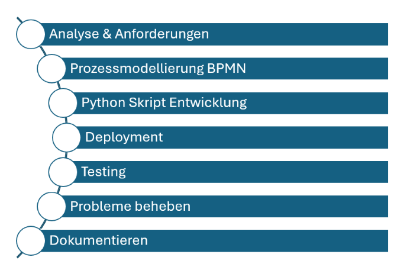

# Teil 3 Realisieren
Kommen wir zur Umsetzung des Projektes. In diesem Teil wird genau beschrieben, wie alles realisiert wurde und wie ich vorgegangen bin. Es wird getestet und geprüft, sodass ersichtlich ist, ob alles funktioniert wie es soll. Falls Probleme aufgetaucht sind, werden diese ebenfalls beschrieben, inklusive Lösungsweg.

- [Teil 3 Realisieren](#teil-3-realisieren)
- [Realisieren](#realisieren)
  - [Implementierungsplan](#implementierungsplan)
  - [Entwicklung Python Skript](#entwicklung-python-skript)
  - [Modellierung in Camunda](#modellierung-in-camunda)
  - [Projekt Umsetzung](#projekt-umsetzung)
  - [Fallbacksolution](#fallbacksolution)
- [Kontrollieren](#kontrollieren)
  - [Testing](#testing)
    - [Testkonzept](#testkonzept)
    - [Testdurchführung](#testdurchführung)
  - [Schulung Team](#schulung-team)

# Realisieren
Nun wird die Realisierung beschrieben. Zuerst wird ein Plan erstellt, wie genau Implementiert wird und danach wird umgesetzt. Eine Fallbacksolution wird ebenfalls beschrieben, imfalle das etwas schief geht.

## Implementierungsplan
Hier wird grob dargestellt, wie in diesem Projekt vorgegangen wird.

Der Implementierungsplan für den automatisierten Onboarding-Prozess zeigt die sieben Hauptarbeiten die ausgeführt werden. Jeder dieser Arbeiten ist sher wichtig für das Gesamtprodukt und keines davon kann weggelassen werden.

## Entwicklung Python Skript
## Modellierung in Camunda
## Projekt Umsetzung
## Fallbacksolution

# Kontrollieren
Die Kontrolle ist sehr wichtig. So kann versichert werden, dass das Enprodukt funktioniert und alle Tests erfolgreich geklappt haben.

## Testing
### Testkonzept
| Testperson | Datum |
| ---------- | ----- |

### Testdurchführung

## Schulung Team

> Back [Page](https://github.com/lauradubach/Semesterarbeit2/blob/main/Sites/Teil%202%20Vorbereitung.md)
>
> Next [Page](https://github.com/lauradubach/Semesterarbeit2/blob/main/Sites/Teil%204%20Abschluss.md)