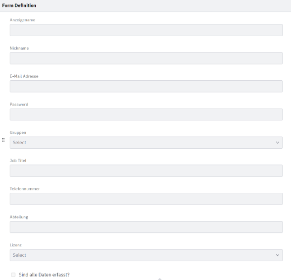
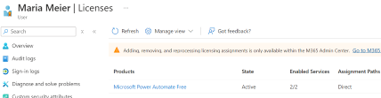

# Teil 3 Realisieren
Kommen wir zur Umsetzung des Projektes. In diesem Teil wird genau beschrieben, wie alles realisiert wurde und wie ich vorgegangen bin. Es wird getestet und geprüft, sodass ersichtlich ist, ob alles funktioniert wie es soll. Falls Probleme aufgetaucht sind, werden diese ebenfalls beschrieben, inklusive Lösungsweg.

- [Teil 3 Realisieren](#teil-3-realisieren)
- [Realisieren](#realisieren)
  - [Implementierungsplan](#implementierungsplan)
  - [Entwicklung Python Skript](#entwicklung-python-skript)
      - [Meine API Permissions:](#meine-api-permissions)
    - [Aufgetretene Probleme](#aufgetretene-probleme)
  - [Modellierung \& Deployment in Camunda](#modellierung--deployment-in-camunda)
    - [Aufgetretene Probleme](#aufgetretene-probleme-1)
  - [Fallbacksolution](#fallbacksolution)
- [Kontrollieren](#kontrollieren)
  - [Testing](#testing)
    - [Testkonzept](#testkonzept)
    - [Testdurchführung](#testdurchführung)


# Realisieren
Nun wird die Realisierung beschrieben. Zuerst wird ein Plan erstellt, wie genau Implementiert wird und danach wird umgesetzt. Eine Fallbacksolution wird ebenfalls beschrieben, imfalle das etwas schief geht.

## Implementierungsplan
Hier wird grob dargestellt, wie in diesem Projekt vorgegangen wird.


Der Implementierungsplan für den automatisierten Onboarding-Prozess zeigt die sieben Hauptarbeiten die ausgeführt werden. Jeder dieser Arbeiten ist sher wichtig für das Gesamtprodukt und keines davon kann weggelassen werden.

## Entwicklung Python Skript

#### Meine API Permissions:


### Aufgetretene Probleme

Zuerst hatte ich folgendes Problem:


Lösung: 

`pip install requests`

Danach hatte ich folgendes Problem:


Lösung:

`pip install msal`

Nun hatte ich folgendes Problem:


Um herauszufinden was das Problem ist, habe ich folgendes Skript verwendet:

```python
import msal

# Konfigurationsvariablen

CLIENT_ID = "xxxx"
CLIENT_SECRET = "xxxx"
TENANT_ID = "xxxx"

# Authority-URL
authority = f"https://login.microsoftonline.com/{TENANT_ID}"

# MSAL-Client erstellen
app = msal.ConfidentialClientApplication(
    CLIENT_ID,
    authority=authority,
    client_credential=CLIENT_SECRET)

# Versuche, ein Access Token abzurufen
print("Hole Access Token...")
response = app.acquire_token_for_client(scopes=["https://graph.microsoft.com/.default"])

# Debugging: Gibt die vollständige Antwort aus
print("Antwort vom Token-Abruf:")
print(response)

# Überprüfe, ob das Token erfolgreich abgerufen wurde
if "access_token" in response:
    print("Access Token erfolgreich abgerufen!")
    access_token = response["access_token"]
else:
    print("Fehler beim Abrufen des Access Tokens:")
    print(response.get("error"))
    print(response.get("error_description"))
    print("Prozess abgebrochen.")
    exit()  # Beendet das Skript`
```

Nun konnte ich im debugger sehen dass es am Client secret lag und ich den value hinterlegen muss und nicht die ID.

Nun erhielt ich aber folgenden Error:

```bash
Fehler beim Erstellen des Benutzers: 403 - {"error":{"code":"Authorization_RequestDenied","message":"Insufficient privileges to complete the operation.","innerError":{"date":"2024-12-05T12:07:47","request-id":"3957016c-f6a7-40df-a671-84f3581a6e7a","client-request-id":"3957016c-f6a7-40df-a671-84f3581a6e7a"}}}
```
Als ich den Fehlercode gesucht habe, habe ich herausgefunden, dass mir noch folgende Rechte gefehlt haben:

- `User.ReadWrite.All`
- `Directory.ReadWrite.All`

Nun musste ich beim Admin die Freigabe dieser Rechte anfragen. Sobald ich die Rechte hatte, hat es geklappt:


Nun wollte ich die Funktion im Skript hinzufügen, dass eine Lizenz zugewiesen wird. Hier bekam ich folgenden Error:

```bash
Fehler beim Zuweisen der Lizenz: 400 - {"error":{"code":"Request_BadRequest","message":"License assignment cannot be done for user with invalid usage location.","innerError":{"date":"2025-01-06T12:25:59","request-id":"613a2372-1a63-4b13-8c94-56793bbb140c","client-request-id":"613a2372-1a63-4b13-8c94-56793bbb140c"}}}
Onboarding abgeschlossen.

Process finished with exit code 0
```

Lösung:

Ich musste folgendes im Skript ergänzen:

`"usageLocation": "CH”`

Um die ID der Lizenz herauszufinden habe ich folgendes Skript verwendet:

```python
`import requests
from msal import ConfidentialClientApplication

# Azure Konfiguration
CLIENT_ID = "xxxx"
CLIENT_SECRET = "xxxx"
TENANT_ID = "xxxx"`

`GRAPH_API_URL = "https://graph.microsoft.com/v1.0"
SCOPES = ["https://graph.microsoft.com/.default"]

def get_access_token():    <i>"""Holt ein Access Token von Azure AD."""    </i>
    try:
        app = ConfidentialClientApplication(
            CLIENT_ID,
            authority=f"https://login.microsoftonline.com/{TENANT_ID}",
            client_credential=CLIENT_SECRET,
        )
        result = app.acquire_token_for_client(scopes=SCOPES)
        if "access_token" in result:
            return result["access_token"]
        else:
            raise Exception("Konnte kein Access Token abrufen.")
    except Exception as e:
        print(f"Fehler beim Abrufen des Access Tokens: {e}")
        return None

def get_sku_ids(token):    <i>"""Liest alle SKU-IDs (Lizenzen) aus."""    </i>
    headers = {
        "Authorization": f"Bearer {token}",
        "Content-Type": "application/json",
    }
    url = f"{GRAPH_API_URL}/subscribedSkus"
    try:
        response = requests.get(url, headers=headers)
        if response.status_code == 200:
            skus = response.json()["value"]
            print("Verfügbare SKU-IDs und Produkte:")
            for sku in skus:
                print(f"SKU-ID: {sku['skuId']}, Produktname: {sku['skuPartNumber']}")
        else:
            print(f"Fehler beim Abrufen der Lizenzen: {response.status_code} - {response.text}")
    except Exception as e:
        print(f"Fehler bei der Anfrage: {e}")

def main():
    print("Hole Access Token...")
    token = get_access_token()
    if not token:
        print("Token konnte nicht abgerufen werden. Prozess abgebrochen.")
        return
    print("Lese SKU-IDs aus...")
    get_sku_ids(token)

if __name__ == "__main__":
    main()`
```

Das vollendeten Skripts sind hier abgelegt:

> [Skript](https://github.com/lauradubach/Semesterarbeit2/tree/main/Skripts)

## Modellierung & Deployment in Camunda

Hier ist das erstellte BPMN:


Hier ist das Formular, um die Angaben des users anzulegen:



### Aufgetretene Probleme

Error beim Deployen im Camunda:

`ENGINE-12018 History Time To Live (TTL) cannot be null. TTL is necessary for the History Cleanup to work`

Lösung:


Nächster Error beim Deployen:

`ENGINE-09005 Could not parse BPMN process. Errors: attribute 'messageRef' is required | resource OnboardingProzess.bpmn | line 64 | column 74 Invalid 'messageRef': no message with id 'null' found. | resource OnboardingProzess.bpmn | line 64 | column 74 [ deploy-error ]`

Lösung:


Nächster Error:

`* Timer needs configuration (either timeDate, timeCycle or timeDuration is needed). | resource OnboardingProzess.bpmn | line 92 | column 70 [ deploy-error ]`

Lösung: 


## Fallbacksolution

Da das Projekt auf dem Demo Tenant durchgeführt wurde, benötigt es keine Fallbacksolution. Falls etwas nicht klappt während dem Betrieb kann das Onboarding einfach Manuell durchgeführt werden, bis das Problem behoben wird.

# Kontrollieren
Die Kontrolle ist sehr wichtig. So kann versichert werden, dass das Enprodukt funktioniert und alle Tests erfolgreich geklappt haben.

## Testing
### Testkonzept
| Testperson | Datum |
| ---------- | ----- |
| Laura Dubach | 23.12.2024 |

| System | Testmittel | Testmethode |
| -------| ---------- | ----------- |
| Azure Entra ID | Python Skript, Camunda, Docker Desktop | Funktionaler Test

In diesem Test wird über das Camunda Form user Daten eigetragen, dann wird das Python Skript denn User auf dem Azure Entra ID erstellen. Die Camunda Applikation läuft auf dem Docker Desktop. So wird gezeigt, ob das Projekt funktioniert hat.

### Testdurchführung

| Testfall | Erwartetes Ergebnis | Testresultat |
| ---------| ------------------- | ------------ |
| Formular ausfüllen | Das Formular erscheint im Camunda und kann korrekt ausgefüllt werden. | Sobald der Prozess gestarten wurde, ist das Formular erschienen und konnte ausgefüllt und commited werden:  |
| User erstellen | Der User wird über das Python Skript erstellt und erscheint im Entra ID. | Das Python Skript läuft erfolgreich durch und erstellt denn User im Azure Entra ID:  | 

**Hier wird kurz alles gezeigt was erstellt wurde**

Die Daten die mitgegeben wurden:


Die Gruppe die ausgewählt wurde, inklusive eine Dynamische die automatisch jedem User zugewiesen wird:


Die Lizenz welche im Form angegeben wurde:



Zum Schluss noch die Ausgabe vom Python Skript:


> Back [Page](https://github.com/lauradubach/Semesterarbeit2/blob/main/Sites/Teil%202%20Konzeption.md)
>
> Next [Page](https://github.com/lauradubach/Semesterarbeit2/blob/main/Sites/Teil%204%20Einf%C3%BChrung.md)